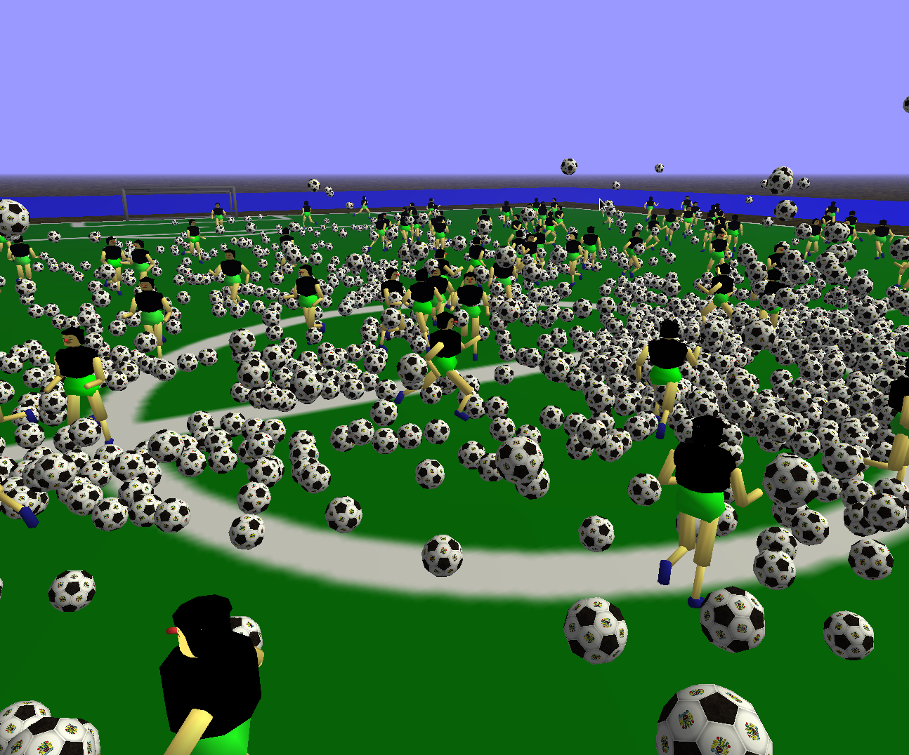

Main class = no.ivark.soccerdemo.SoccerDemo

Run with -Djava.library.path=/my/library/path/ -Dsun.java2d.noddraw=true

Put the required libraries in the lib-folder (see lib/README.txt)

Keys:
-----
a 		- increase speed fwd
z 		- increase speed bwd
arrows 	- change direction
m		- toggle wireframe 
f		- toggle fog

